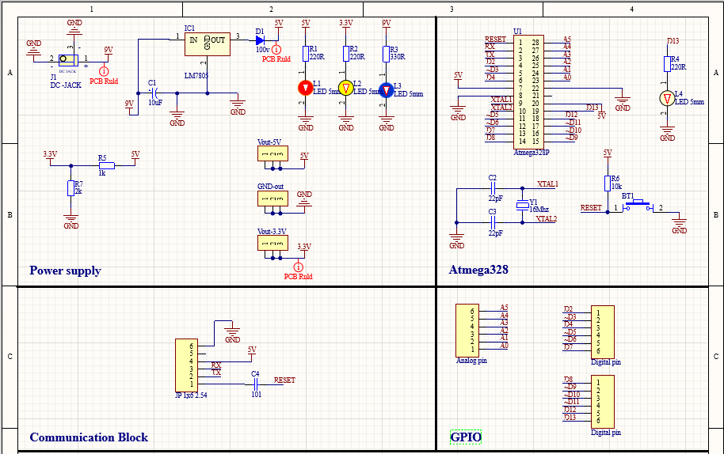
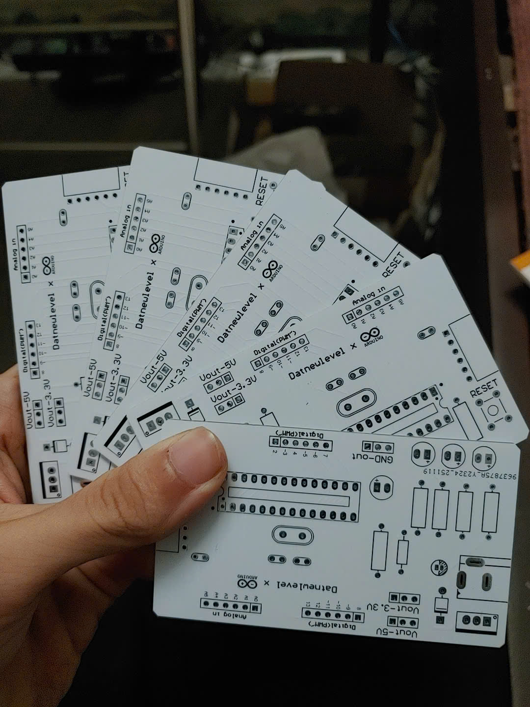
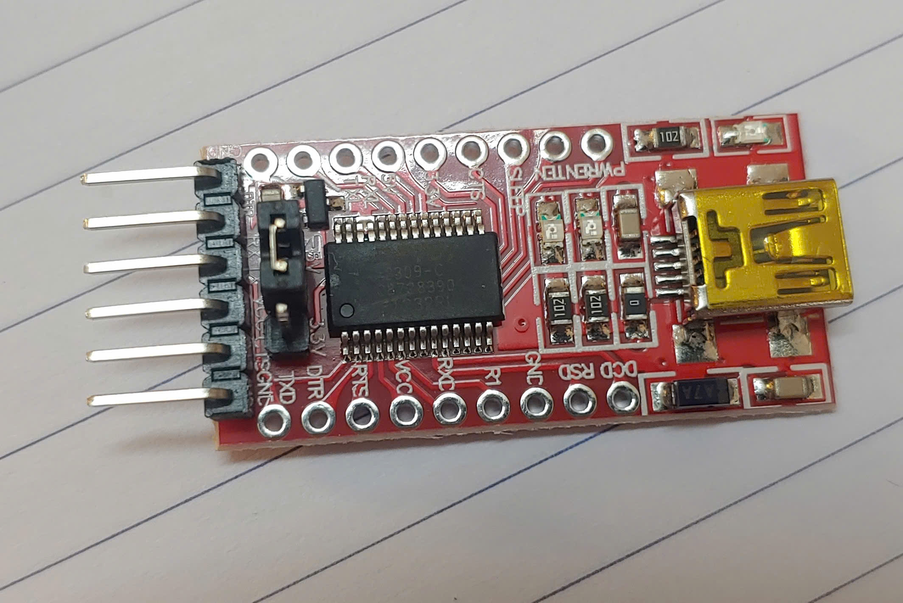

# My Own Arduino Project

## Overview

This is a personal project to design a custom Arduino-compatible development board. The goal was to create a personalized version of an Arduino board with a few minor improvements over the original Arduino Uno R3.

The board uses an external USB to UART module with an FT232RL chip for communication and programming, instead of having an onboard communication chip.

## Improvements Over Arduino Uno R3

*   **Additional Power Pins:** Added extra header rows for 5V and 3.3V power, making it easier to connect peripherals and modules.
*   **Personalized Design:** The component layout and board design are customized for a personal touch and optimized for specific use cases.

## Design Software

The entire schematic and PCB were designed using **Altium Designer**.

## Project Images

Here are some images of the project:

**1. Schematic**

**2. PCB Layout**

**3. Finished Board**

**4. USB to UART Communication Module**

